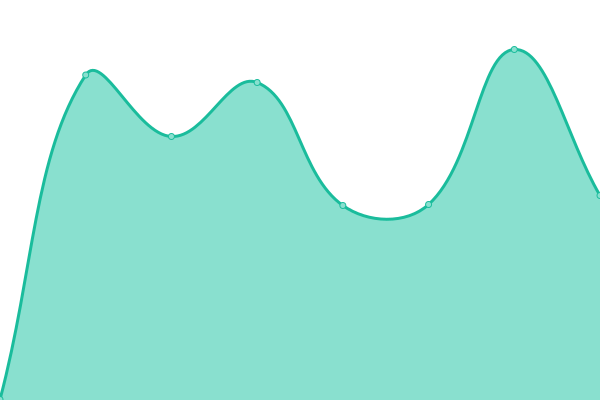
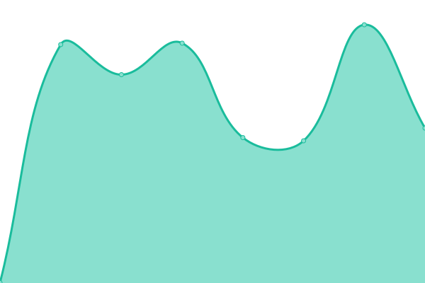
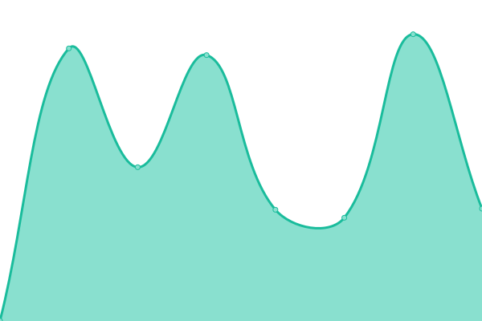

# [📈 Live Status](https://next.status.loungeup.com): <!--live status--> **🟧 Partial outage**

This repository contains the open-source uptime monitor and status page for [LoungeUp](https://next.status.loungeup.com), powered by [Upptime](https://github.com/upptime/upptime).

With [Upptime](https://upptime.js.org), you can get your own unlimited and free uptime monitor and status page, powered entirely by a GitHub repository. We use [Issues](https://github.com/loungeup-ops/status/issues) as incident reports, [Actions](https://github.com/loungeup-ops/status/actions) as uptime monitors, and [Pages](https://next.status.loungeup.com) for the status page.

<!--start: status pages-->
<!-- This summary is generated by Upptime (https://github.com/upptime/upptime) -->
<!-- Do not edit this manually, your changes will be overwritten -->
<!-- prettier-ignore -->
| URL | Status | History | Response Time | Uptime |
| --- | ------ | ------- | ------------- | ------ |
|  [Portal](https://portal.loungeup.com) | 🟥 Down | [portal.yml](https://github.com/loungeup-ops/status/commits/HEAD/history/portal.yml) | 

 634ms
     
 | 

<a href="https://next.status.loungeup.com/history/portal">99.79%</a>
    

|  [Back-Office](https://admin.loungeup.com/oauth/callback) | 🟥 Down | [back-office.yml](https://github.com/loungeup-ops/status/commits/HEAD/history/back-office.yml) | 

 552ms
     
 | 

<a href="https://next.status.loungeup.com/history/back-office">99.80%</a>
    

|  [ID (Authentication)](https://id.loungeup.com/realms/production) | 🟥 Down | [id-authentication.yml](https://github.com/loungeup-ops/status/commits/HEAD/history/id-authentication.yml) | 

 491ms
     
 | 

<a href="https://next.status.loungeup.com/history/id-authentication">99.99%</a>
    

|  [API](https://api.loungeup.com) | 🟥 Down | [api.yml](https://github.com/loungeup-ops/status/commits/HEAD/history/api.yml) | 

 580ms
     
 | 

<a href="https://next.status.loungeup.com/history/api">99.81%</a>
    

|  [Dmbook pro](https://app.dmbook.pro/) | 🟥 Down | [dmbook-pro.yml](https://github.com/loungeup-ops/status/commits/HEAD/history/dmbook-pro.yml) | 

 502ms
     
 | 

<a href="https://next.status.loungeup.com/history/dmbook-pro">100.00%</a>
    

|  [Images & medias](https://static.loungeup.com) | 🟩 Up | [images-and-medias.yml](https://github.com/loungeup-ops/status/commits/HEAD/history/images-and-medias.yml) | 

 923ms
     
 | 

<a href="https://next.status.loungeup.com/history/images-and-medias">100.00%</a>
    

<!--end: status pages-->

[**Visit our status website →**](https://next.status.loungeup.com)

## 📄 License

- Powered by: [Upptime](https://github.com/upptime/upptime)
- Code: [MIT](./LICENSE) © [LoungeUp](https://next.status.loungeup.com)
- Data in the `./history` directory: [Open Database License](https://opendatacommons.org/licenses/odbl/1-0/)
